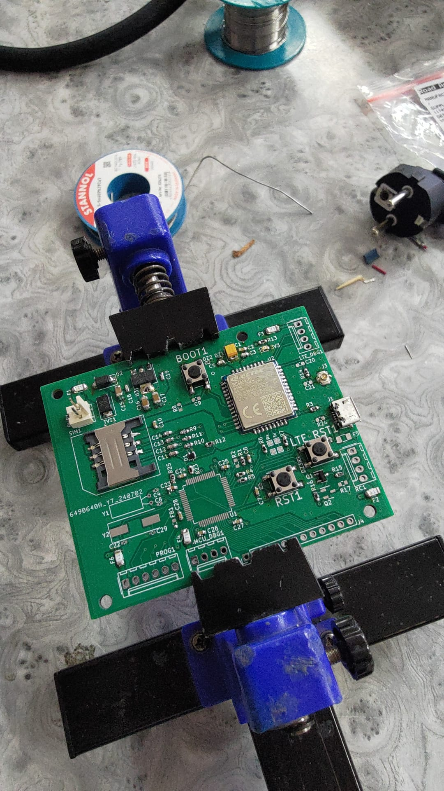
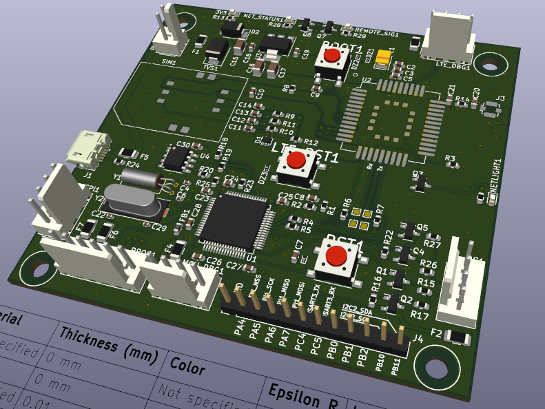

# MQTT-GSM-receiver
_A basic IoT device that connects to a mobile network and activates an output pin based on an MQTT message. The project is a work in progress_

## Purpose
This project is intended to be a basis of operation for a vast number of possible uses. The microcontroller connects to an MQTT topic and checks for key messages. When the appropriate message is received, an output pin is activated. With aditional periferal hardware, the device can be adapted to do various tasks. An important detail about the project is that unlike most IoT devices that connect via WiFi, this one connects via the mobile network, allowing it to be placed outside the range of WiFi networks: backyards, open fields, practically anywhere. The project also serves to prived an introduction to RF connectivity.

## Description
A device that uses the STM32L476RET6 microcontroller. The microcontroller communicates with a Quectel BC660K-GL GSM module using AT commands. The device subsribes to a topic on a server set up by the user, and an mobile phone application can send messages to that topic, which trigger the IoT device to activate an output signal. The device features a SIM card, EEPROM, and an input/ouput interface. Cybersecurity is of crucial importance for this application, however it is far from being developed at the time of writing. Currently an external antenna is used, but future iterations may include a built-in PCB antenna.

## Overview
- Quectel CB660K-GL GMS module for connectivity
- EEPROM for cybersecurity credentials
- Basis for projects with a well-defined use case

## System architecture
### Microcontroller
The system is based on an STM32L476RET6. They are readily available and powerful enough for encryption tasks. The microcontroller communicates vie UART using AT commands with the GSM module
### GSM Module
The module is Quectel's BC660K-GL. This is one of the cheapest GMS modules available, and even they are sometimes difficult to get by. The module is very easy to use with the AT commands, which makes development much faster. An important note is the antenna design, which is currently a weak spot in the project. Occasionally, the device simply loses its connection with the network. The module requires a SIM card. Some carriers offer IoT-specific services, which come with only data at a very slow rate, but are also very cheap on a monthly level.
### Antenna
The antenna is the weak link, and much care is needed when routing the antenna signal, even if an external antenna is used. Impedance control is very important here.

## Firmware
### Implemented features
- [x] Connecting to a GSM network
- [x] Subscribing to a topic
- [x] Error handling - lost connection triggers a reconnection attempt
- [x] Output pin control based on MQTT messages
### Planned features
- [ ] Cybersecurity
- [ ] Reporting/check-in feature
- [ ] Sending data from the input to the server
